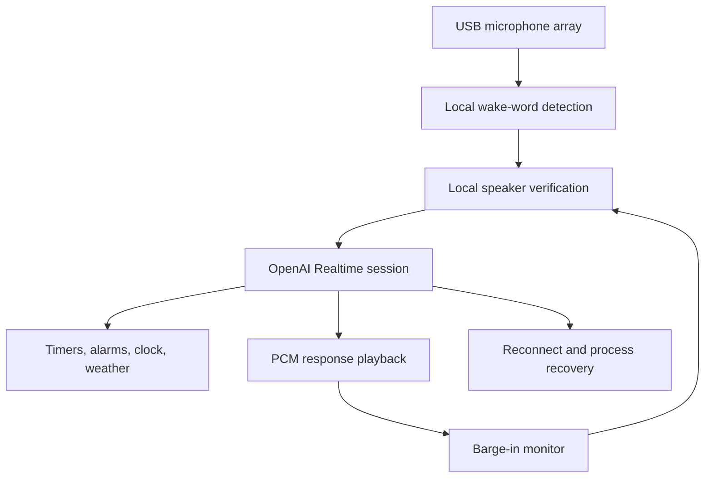

# Nexus Voice Assistant

Nexus is a self-hosted, always-on voice assistant built around the OpenAI Realtime API. It runs on a Linux computer with a USB microphone array and conventional speakers, combining local wake-word detection and speaker verification with cloud-based conversational reasoning and speech.

The project began as a practical replacement for a household smart speaker. Its design emphasizes low-latency conversation, local control, recoverability, and operation as a long-running system service.

## Highlights

- Dual-channel wake-word detection with configurable confidence thresholds
- Local speaker verification using SpeechBrain ECAPA embeddings
- OpenAI Realtime audio input, tool calls, and speech output
- Conversational follow-up window after each response
- Barge-in support with acoustic echo cancellation-aware monitoring
- Persistent alarms, countdown timers, clock, saved location, and weather tools
- Automatic audio-device discovery by device name
- Exponential reconnect backoff for transient failures
- Immediate recovery from the Realtime API's maximum session duration
- Full process replacement after repeated WebSocket handshake failures
- Continuous operation under systemd with persistent journald logs

## Architecture



## Reference hardware

The production installation uses:

- Dell OptiPlex running Debian Linux
- ReSpeaker XVF3800 four-microphone USB array
- Intel HDA analog audio output
- PipeWire/WirePlumber audio stack
- systemd for startup and supervision

Device names and all private model paths can be overridden with environment variables.

## Repository layout

```text
.
├── echo.py                         Main application
├── requirements.txt               Python dependencies
├── .env.example                   Safe configuration template
├── alarms.example.json            Empty alarm-store example
├── settings.example.json          Sanitized settings example
├── systemd/
│   └── nexus.service.example      Service template
└── docs/
    └── sample-session.txt         Sanitized runtime example
```

Wake-word models, speaker embeddings, downloaded ML models, recordings, credentials, saved locations, active alarms, logs, and virtual environments are intentionally excluded from version control.

## Setup overview

1. Install the system audio dependencies for your Linux distribution, including PortAudio.
2. Create a Python virtual environment and install `requirements.txt`.
3. Place your wake-word model and enrolled speaker embeddings under `models/`, or configure their paths through environment variables.
4. Copy `.env.example` to a private environment file and add `OPENAI_API_KEY`.
5. Adjust the microphone and speaker name fragments for your devices.
6. Run `python echo.py` interactively to verify audio and model loading.
7. Adapt `systemd/nexus.service.example` for unattended operation.

Example environment setup:

```bash
python3 -m venv .venv
source .venv/bin/activate
pip install --upgrade pip
pip install -r requirements.txt
export OPENAI_API_KEY="your-key-here"
python echo.py
```

## Reliability design

OpenAI Realtime sessions have a finite lifetime. Nexus treats a maximum-duration event as a connection failure and starts a new session immediately. Ordinary connection failures use capped exponential backoff.

Some long-running audio and ML workloads can enter a degraded state where new WebSocket handshakes continue timing out even though ordinary HTTPS remains healthy. After three consecutive opening-handshake timeouts, Nexus exits immediately. The accompanying systemd policy then replaces the complete process group, reinitializing the audio, wake-word, speaker-recognition, DNS, TLS, and WebSocket state.

## Security and privacy

- The API key is read from `OPENAI_API_KEY`; it is not hard-coded.
- Speaker embeddings are biometric data and must not be committed.
- Saved locations and alarm data remain local and are ignored by Git.
- Tool logs redact sensitive arguments where appropriate.
- `.gitignore` blocks the common model, recording, credential, state, and backup formats used by the production installation.

Before publishing changes, inspect the staged content:

```bash
git diff --cached
git grep -nEi 'api[_-]?key|password|secret|token|bearer'
```

## Current status

Nexus is deployed as an always-on household assistant. Wake detection, speaker verification, Realtime conversation, audio playback, timers, persistent alarms, weather lookup, follow-up speech, barge-in, automatic reconnection, and systemd recovery have all been exercised on the reference hardware.

## Future improvements

- Split the single-file prototype into testable modules
- Add unit tests for alarm persistence and connection-state transitions
- Package hardware-specific ReSpeaker routing separately
- Add structured logging and health metrics
- Provide a guided speaker-enrollment utility

## Author

Ryan Yarbery
